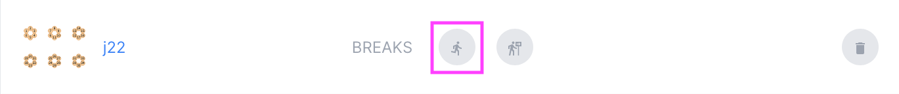
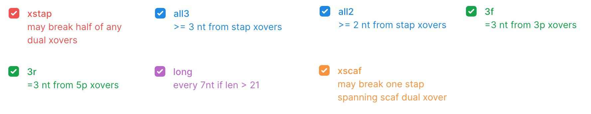

# Autobreaks

[Purpose](#purpose)  
[Running Autobreaks](#running-sutobreaks)  
[Options](#options)  
[Output](#output)  
[Examples](#examples)  
[FAQ / Troubleshooting](#faq--troubleshooting)  

## Purpose
---
The Autobreak algorithm was developed to quickly create staple variants of a design and
assess the integrity of those variants.

* Break designs into sub-designs with new staple sequences
* Evaluate integrity of the new designs with a score algorithm and 2D and 3D heatmaps
* Several options to fine tune autobreak process
* Display new designs in both 2D and 3D views

Note: Autobreaks is a CPU heavy process, and can take several 
seconds (~5 - 20 seconds) to complete.

## Running Autobreaks
---
In many cases the default settings will be enough to get a good break. You can quickly run an 
Autobreak with the default settings with just a click of a button. There is also an option to customize
the Autobreak settings if you have specific requirements or just want to experiment with the Autobreaks algorithm.

### Default Autobreak
1. Click the **Run Autobreak** button for the desired design on the project page.

 
### Custom Autobreak
1. Click the **Autobreak Form** button for the desired design on the project page.   
2. A form with several settings will appear. The initial settings will be the default. 
Adjust the settings as desired. 

Note: There is a **Restore Defaults** button at the bottom of
the page if you'd like to quickly reset the form to the default settings.

## Options
---
There are several customizable options available when running an Autobreak. 
These are separated into three sections: **Break Rules**, **Length Settings**, and **Additional Rules**.

### Break Rules
Rules specify potential staple breaking positions. 
There are seven different rules in total. The default xstap and all3 combination 
allows breaking at staple xovers and all positions ±3 nt away from xovers.

|  rule  |   description   |
| ------ | --------------- |
| **xstap***| may break half of any dual xovers |
| **all3*** | \> = 3 nt from stap xovers |
| **all2**  | \> = 2 nt from stap xovers |
| **3f**    | 3 nt from 3p xovers |
| **3r**    | 3 nt from 5p xovers |
| **long**  | every 7nt if len > 21 |
| **xscaf** | may break one stap spanning scaf dual xover |

### Length Settings
Exclude staples from breaking based on length and specify the range of lengths for broken staples.

#### Before Breaking
Don't plan to break staples already shorter than a specified amount.    
Range is **0** to **100**, default is **21**.

#### After Breaking
Specify the range for the staple length, using minimum and maximum values.
Range is **10** to **100**, default is **21** to **60**.

### Additional Settings

#### Read Only
Used to score already-broken designs.
Default is **False**.

#### Sort Oligos
Always break longest first.
Default is **False**.

#### N-solutions
Number of solutions to find.
Range is **1** to **30**. Default is **10**.

## Output
---
 

## Examples
---
 

## FAQ / Troubleshooting
---
 

