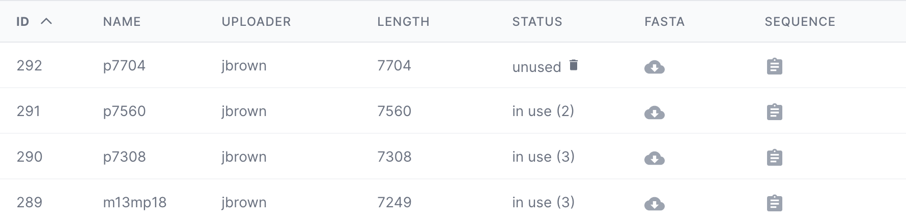
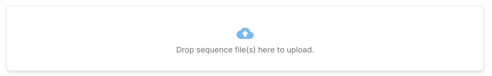
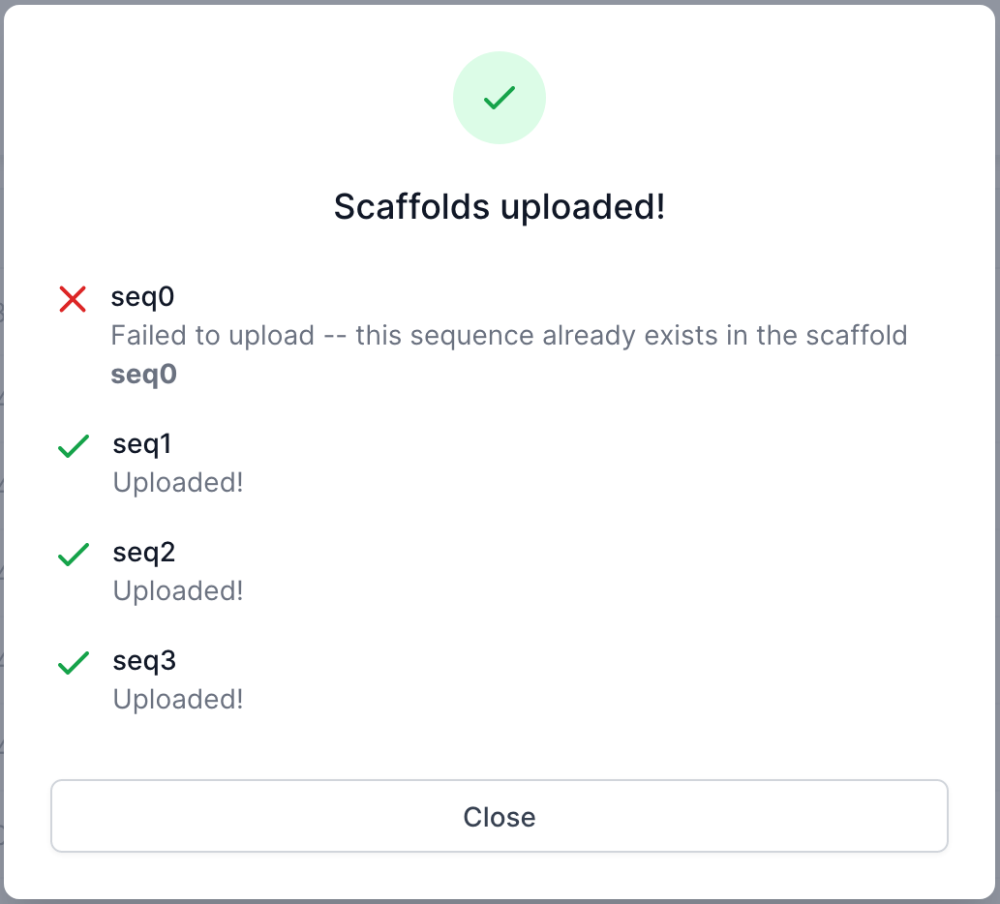
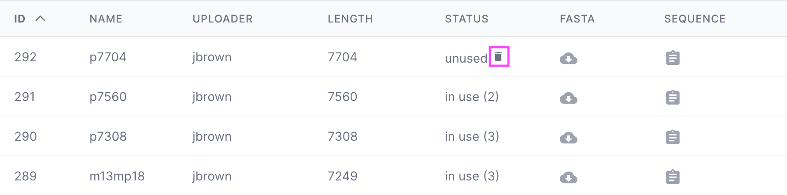
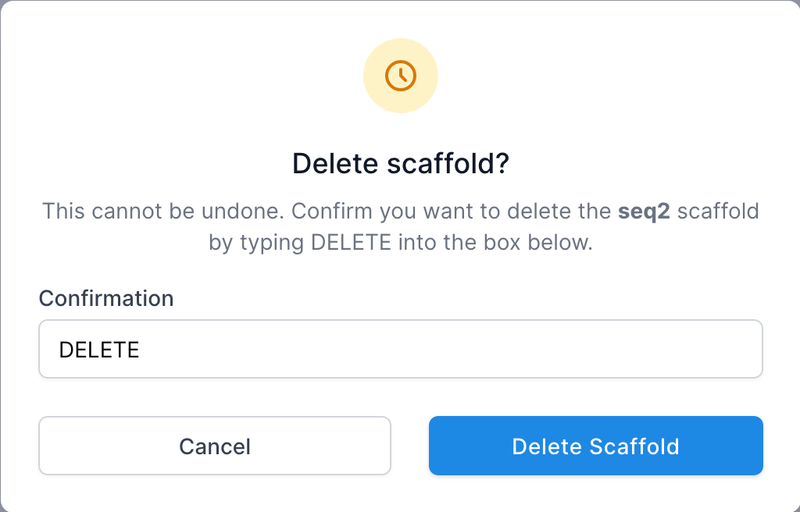
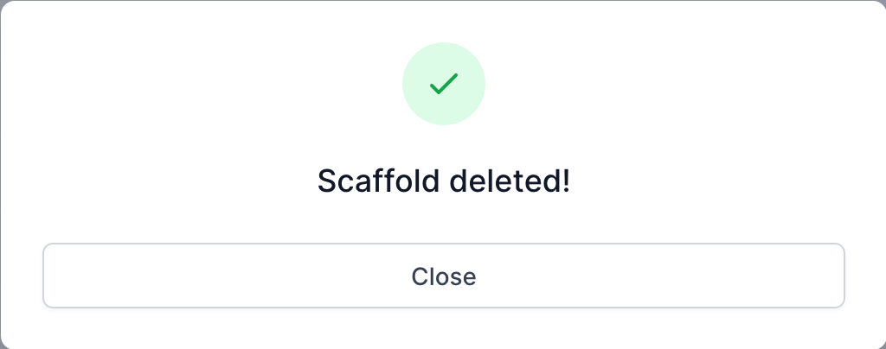

# Gels [TODO]

[Purpose](#purpose)  
[Gels Table](#gels-table)  
[Uploading a Gel](#uploading-a-gel)  
[Gel Analysis](#gel-analysis)  
[Options](#options)  
[FAQ / Troubleshooting](#faq--troubleshooting)  

## Purpose
---
The Gels page allows a user to upload and analyze real data obtained through 
gel electrophoresis in the lab.

* Upload experiential gel data
* Algorithm to analyze gel data
* Organize and review gel data


## Gels Table
---

<span style="color: red;">**TODO...**</span>  

<br>
Scaffolds are listed in a table on the Scaffold page with the following columns:

* **ID** - Item ID in the database
* **Name** - Name of the scaffold, denoted in teh FASTA file, typically associated with the length
* **Uploader** - the team member that uploaded the scaffold
* **Length** - length of the sequence in terms of bases (e.g. "ATCG" = length of 4)
* **Status** - Signifies whether or not the scaffold is being used by any designs. If so, it will provide
  the number of designs using the scaffold. If not being used, it will allow the user to delete the scaffold
  if desired. Note: scaffolds can only be deleted if they are not being used by any designs.
* **FASTA** - Click to download the FASTA file for the scaffold
* **Sequence** - Click to copy the sequence to the clipboard

## Uploading a Gel
---
A single gel image in a **TIFF** file format can be uploaded as follows:

1. Click the upload dropzone or drag and drop the gel image (TIFF) into the dropzone area.   
<span style="color: red;">**TODO...**</span>
   

2. A window will pop up displaying the results of the upload, and whether or not
   the upload was successful. If a scaffold already exists in the database, then it will not be uploaded
   again.  
   


## Gel Analysis
---
1. Click the **REANALYZE** button for the desired design on the project page.   
<span style="color: red;">**TODO...**</span>

<br>


## Options
---
```html

```
<span style="color: red;">**TODO...**</span>   
There are several customizable options available when running an Gel Analysis. 

### ...


## Deleting a Gel
---

<span style="color: red;">**TODO...**</span>   
Gels can only be deleted if they are not being used by any designs.
You can determine if a scaffold is being used by referring to the "Status" column.
If the scaffold is not being used, a Delete icon will be available.

1. Click the delete icon
   


2. Type "DELETE" in the dialog that pops up
   


3. A confirmation window will pop up uppon successful deletion. The scaffold will no
   longer be in the list.   
   

   

## FAQ / Troubleshooting
---
<br>


