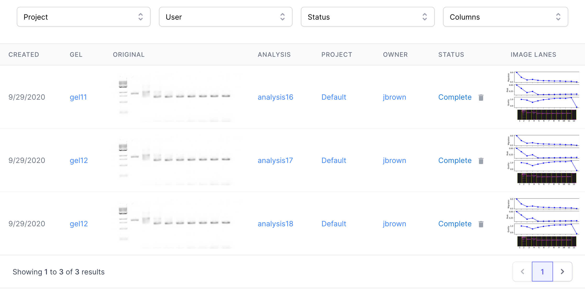

# Gels [TODO]

[Purpose](#purpose)  
[Gel Analysis Table](#gel-anaylsis-table)  
[Uploading a Gel](#uploading-a-gel)  
[Gel Analysis](#gel-analysis)  
[Options](#options)  
[FAQ / Troubleshooting](#faq--troubleshooting)  

## Purpose
---
The Gels page allows a user to upload and analyze real data obtained through 
gel electrophoresis in the lab.

* Upload experiential gel data
* Algorithm to analyze gel data
* Organize and review gel data

## Gel Anaylsis Table
---

 
Gel Analyses are listed in a table on the Gels page with the following columns:

* **Created** - The date the gel was uploaded.  
* **Gel** - Gel ID that the gel analysis belongs to. There may be multiple gel analyses for a single Gel.  
Clicking the Gel name will navigate to the respective gel detail page.  
* **Original** - Thumbnail of the original gel image uploaded to the site.  
* **Analysis** - Gel Analysis ID.  
  Clicking the gel analysis ID will navigate to the respective gel detail page.  
* **Project** - Project that the gel analysis belongs to.  
  Clicking the project name will navigate to the respective project page.  
* **Owner** - the team member that created the design.  
* **Status** - The state of the gel analysis. 
Possible states are: Queued, Running, Processing, Complete, Error, Stalled, Terminated.  
* **Image Lanes** - Thumbnail of the image lanes for the gel analysis.  

## Uploading a Gel
---
A single gel image in a **TIFF** or **png** file format can be uploaded as follows:

1. Click the upload dropzone or drag and drop the gel image into the dropzone area.   
   

2. A window will pop up asking you to select a project to assign the gel to. A gel cannot be uploaded without
an associated project.

   
3. The gel will take several seconds to analyze, after which a confirmation dialog will pop up if the gel upload was successful.

    

## Original Gel
---
...

 

## Gel Analysis
---
A gel can be reanalyzed with different settings. This will create a new analysis and show up
in the Gel Analysis table for the respective gel. The settings for analysis are in the top
right corner of the gel detail page, with the following options (defaults are marked with a *):
* **Align** - [true*, false] Align the gel image to the viewing plane [VERIFY]
* **Align Method** - [search*, pca] Method for aligning the gel. 
* **Flip Vertically** - [true, false*] Flip the gel image vertically.
* **Custom Threshold** - [true, false*] Use a custom threshold.
* **Threshold** - [0 - 100000000, 225*] Value of custom threshold.
* **Ref Lane** - [0 - 64, 2*] Reference lane, from left to right. [VERIFY]
* **Custom Padding** - [true, false*] Use custom padding.
* **Pad** - [0 - 200, 100*] Value of custom padding.
* **Pad Size** - [0 - 200, 0*] Size of pad.

1. Click the **REANALYZE** button to reanalyze the gel with teh given settings. The 
reanalyze button will only become active when a setting has changed from the default.
The analysis will take several seconds to complete, after which time it will show up 
in the Gel Analysis table.

 

## Options
---
**TODO...**   
There are several customizable options available when running an Gel Analysis. 

### ...

## Deleting a Gel
---

**TODO...**   
Gels can only be deleted if they are not being used by any designs.
You can determine if a scaffold is being used by referring to the "Status" column.
If the scaffold is not being used, a Delete icon will be available.

1. Click the delete icon
   

2. Type "DELETE" in the dialog that pops up
   

3. A confirmation window will pop up uppon successful deletion. The scaffold will no
   longer be in the list.   
   

   

## FAQ / Troubleshooting
---
 

