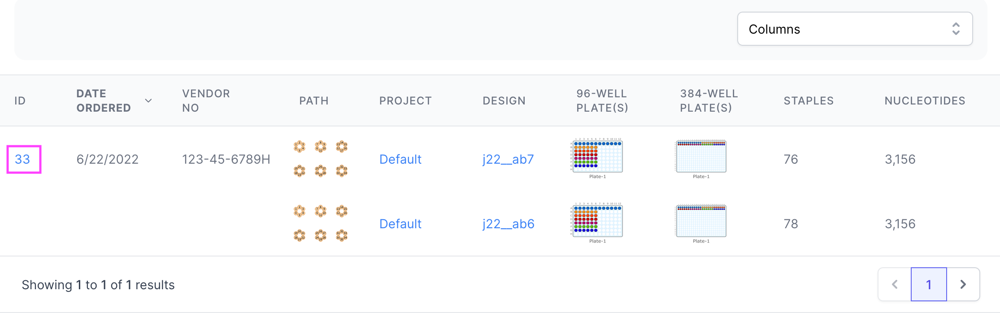
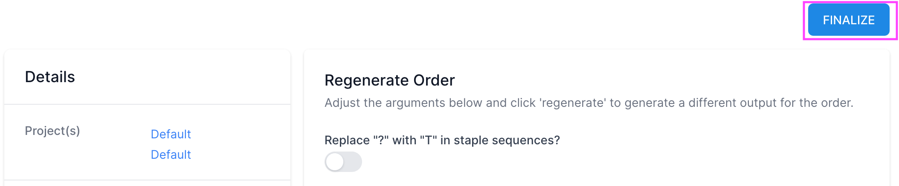
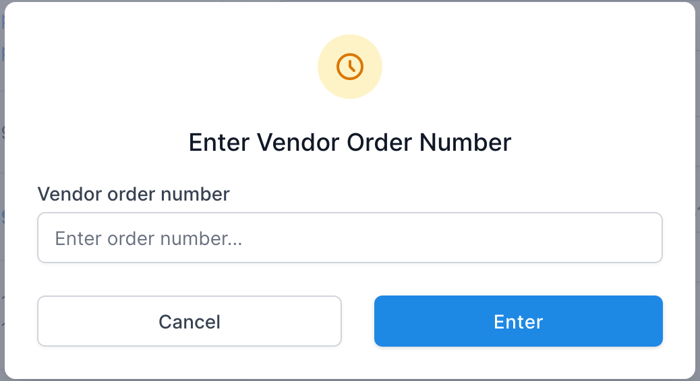
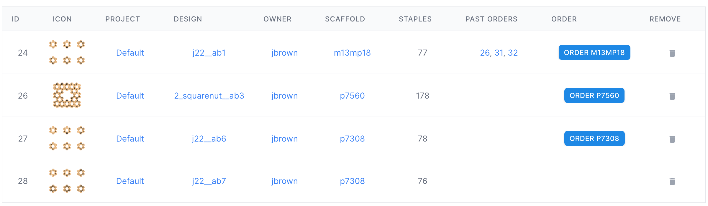
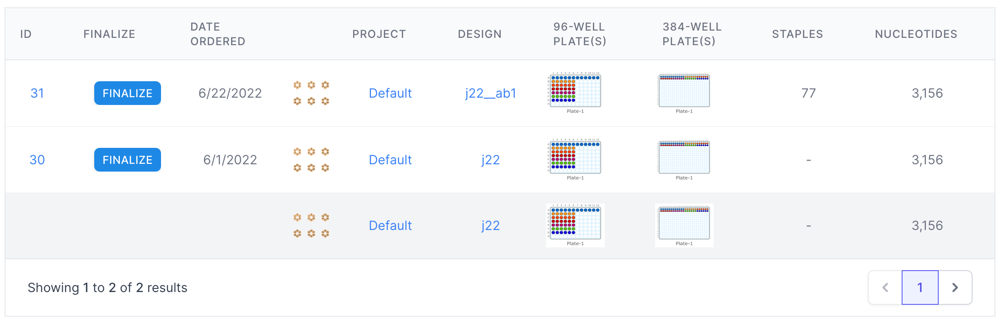
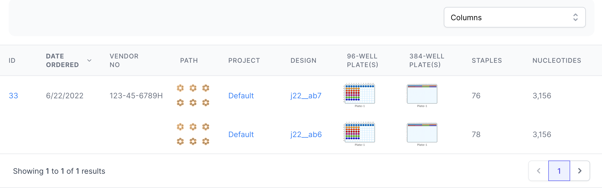

# Orders [TODO]

[Purpose](#purpose)  
[Draft Orders vs. Finalized Orders](#draft-orders-vs-finalized-orders)   
[Cart](#cart)  
[Draft Orders Table](#draft-orders-table)  
[Orders Table](#orders-table)  
[Order Detail](#order-detail)  
[Options](#options)  
[Output](#output)  
[Examples](#examples)  
[FAQ / Troubleshooting](#faq--troubleshooting)  

## Purpose
---
[TODO]

* Create orders to synthesize DNA for any number of designs
* Gouped by underlying scaffold
* View individual color-coded stocks
* Export data for automated pipetting workflows
* Organize order data into draft orders (processing) and finalized (completed)
* Review past orders with filters

 

## Draft Orders vs. Finalized Orders
---
Nanotoolkit can generate and track design orders the lab makes for real-world material. 
An order can be in one of two states during the ordering process:

* Draft
* Finalized

An order takes a few seconds (~10 seconds) for Nanotoolkit to generate the well layouts and other
pertinent order information. During this time the order will show up in the **Draft Orders - Processing** Table on the **Cart** page. 

Once Nanotoolkit has finished processing the designs and created all the necessary information, the order
will move from the Processing table to the **Draft Orders - Completed** table. At this point all the required information has been 
generated, and the lab technician can use this information to place an order with a vendor. While the order is waiting to be 
fulfilled, it will remain in the Draft Orders table for reference. Clicking the **order id** in the table will bring up details 
for the Draft Order. 

Finally, when the material has been received by the lab, the order is considered fulfilled. 
The user can enter a vendor number for the order, effectively marking it as "**Finalized**." 
This will move the order from the Draft Orders table to the **Orders** page, 
where all past fulfilled orders are tracked. 

 
#### Finalizing an Order
To finalize a draft order after material has been received:
1. Find the order on the Cart page and select the **order id**.
   

2. The **Order Detail** page will come up. Click the "Finalize" button in the top right corner.

3. A dialog will pop up. Enter the Vendor Number associated with the order. 
This can be alphanumeric. The intent is to have a way to track the physical order in the lab. After entering
a vendor number and clicking **Enter**, a confirmation will pop up and the order will be moved to the 
**Orders** page. 
   

 

## Cart
---
Items are placed in the Cart from the **Projects** page. After selecting a project,
all the designs for that project will be shown on the right side of the page. 

Only eligible designs will have an "**Add to Cart**" icon available at the far right of the design row.
Clicking this icon will add the design to the cart. Clicking it a second time will remove the item 
from the cart.

When a design has been added to the cart, it will be available to order on the **Cart** page. 
Orders are grouped by an underlying scaffold. In this way, designs that are otherwise unrelated by project or parent 
design will be grouped by scaffold. 

The Cart table has the following columns:

* **ID** - Order id number. Clicking this will navigate to teh order detail page.
* **Icon** - Design Icon.
* **Project** - Project(s) that are part of the order. There may be multiple projects in a single order.
  Clicking the project name will navigate to the respective project page.
* **Design** - Design(s) that are part of the order. There may be multiple designs in a single order.
  Clicking the design name will navigate to the respective design page.
* **Owner** - the team member that created the design.
* **Scaffold** - The underlying scaffold used for the design. Clicking this will navigate to the respective scaffold
on the Scaffold page.
* **Staples** - The number of staples for the order.
* **Past Orders** - Prior order(s), if any, that have included this design. Clicking the order id will navigate to the
respective Order Detail page.
* **Order** - Button to initiate order for the given scaffold. Orders are grouped by the underlying scaffold. 
* **Remove** - Click to remove the design from the cart.

  

## Draft Orders Table
---

    

Draft Orders are listed in a table on the Cart page with the following columns:

* **ID** - Order id number. Clicking this will navigate to teh order detail page.
* **Finalize** - Button to navigate to order detail and enter the vendor number to finalize the order.
* **Date Ordered** - The date the order was created.
* **Icon** - Design Icon.
* **Project** - Project(s) that are part of the order. There may be multiple projects in a single order. 
Clicking the project name will navigate to the respective project page.
* **Design** - Design(s) that are part of the order. There may be multiple designs in a single order.
Clicking the design name will navigate to the respective design page.
* **96-Well Plate(s)** - Displays the first 96-well plate image generated for the order.
* **384-Well Plate(s)** - Displays the first 384-well plate image generated for the order.
* **Staples** - The number of staples for the order.
* **Nucleotides** - The number of nucleotides for the order.

 

## Orders Table
---

Finalized Orders are listed in a table on the Orders page with the following columns:

* **ID** - Order id number. Clicking this will navigate to teh order detail page.
* **Date Ordered** - The date the order was created.
* **Vendor No** - An alphanumeric vendor number associated with the order. This number is entered on the 
Order Detail page when finalizing the order.
* **Path** - Design Icon.
* **Project** - Project(s) that are part of the order. There may be multiple projects in a single order.
  Clicking the project name will navigate to the respective project page.
* **Design** - Design(s) that are part of the order. There may be multiple designs in a single order.
  Clicking the design name will navigate to the respective design page.
* **96-Well Plate(s)** - Displays the first 96-well plate image generated for the order.
* **384-Well Plate(s)** - Displays the first 384-well plate image generated for the order.
* **Staples** - The number of staples for the order.
* **Nucleotides** - The number of nucleotides for the order.

 

## Order Detail
---
Each order has several ...

## Options
---
There are several customizable options available when running an Autobreak. 
These are separated into three sections: **Break Rules**, **Length Settings**, and **Additional Rules**.

## Output
---
 

## Examples
---
 

## FAQ / Troubleshooting
---
 

