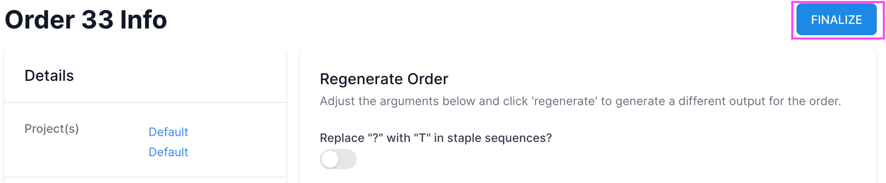

# Orders [TODO]

[Purpose](#purpose)  
[Draft Orders vs. Finalized Orders](#draft-orders-vs-finalized-orders)   
[Putting Items in the Cart](#putting-items-in-the-cart)  
[Orders Table](#orders-table)  
[Order Detail](#order-detail)  
[Options](#options)  
[Output](#output)  
[Examples](#examples)  
[FAQ / Troubleshooting](#faq--troubleshooting)  

## Purpose
---
[TODO]

* Create orders to synthesize DNA for any number of designs
* Gouped by underlying scaffold
* View individual color-coded stocks
* Export data for automated pipetting workflows
* Organize order data into draft orders (processing) and finalized (completed)
* Review past orders with filters

 

## Draft Orders vs. Finalized Orders
---
Orders that have been completed (actual synthesized DNA has been delivered to the lab) 
are considered **Finalized Orders** and are tracked on the **Orders** page. Until an order has been finalized 
it is treated as a **Draft Order**. Draft Orders are found at the bottom of the **Cart** page,
where New, Processing, and Draft (in-progress) orders are tracked.  

 

### Finalizing an Order
To finalize a draft order after material has been received:
1. Find the order on the Cart page and select the **order id**.
   

2. The **Order Detail** page will come up. Click the "Finalize" button in the top right corner.

3. A dialog will pop up. Enter the Vendor Number associated with the order. 
This can be alphanumeric. The intent is to have a way to track the physical order in the lab.   

 

## Putting Items in the Cart
---
[TODO]

## Orders Table
---

**TODO...**  
    

Draft Orders are listed in a table on the Cart page with the following columns:

* **ID** - Item ID in the database
* **Name** - Name of the scaffold, denoted in teh FASTA file, typically associated with the length
* **Uploader** - the team member that uploaded the scaffold
* **Length** - length of the sequence in terms of bases (e.g. "ATCG" = length of 4)
* **Status** - Signifies whether or not the scaffold is being used by any designs. If so, it will provide
  the number of designs using the scaffold. If not being used, it will allow the user to delete the scaffold
  if desired. Note: scaffolds can only be deleted if they are not being used by any designs.
* **FASTA** - Click to download the FASTA file for the scaffold
* **Sequence** - Click to copy the sequence to the clipboard

## Order Detail
---
Each order has several ...

## Options
---
There are several customizable options available when running an Autobreak. 
These are separated into three sections: **Break Rules**, **Length Settings**, and **Additional Rules**.

## Output
---
 

## Examples
---
 

## FAQ / Troubleshooting
---
 

