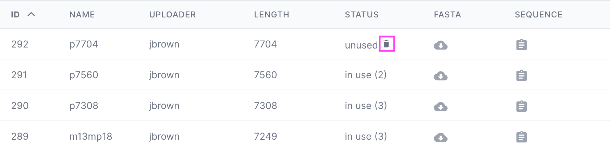

# Scaffolds

[Purpose](#purpose)  
[Scaffold Table](#scaffold-table)  
[Format](#format)  
[Uploading a Scaffold](#uploading-a-scaffold)  
[Deleting a Scaffold](#deleting-a-scaffold)  
[FAQ / Troubleshooting](#faq--troubleshooting)

## Purpose
---
Scaffolds are used for this reason...

* Upload scaffold sequences
* 24 Common scaffolds provided by default
* Download or copy to clipboard scaffold data

Scaffolds are long strands of DNA that provide the scaffolding upon which short 
strand oligos, or staples, are arranged to build new origami designs.

There are 24 common scaffold sequences provided in nanotoolkit, however, you may also
upload other scaffold sequences. In any case, when working with designs on nanotoolkit, 
an existing scaffold must be assigned to be used with the design.


## Scaffold Table
---

<br>

Scaffolds are listed in a table on the Scaffold page with the following columns:

* **ID** - Item ID in the database
* **Name** - Name of the scaffold, denoted in teh FASTA file, typically associated with the length
* **Uploader** - the team member that uploaded the scaffold
* **Length** - length of the sequence in terms of bases (e.g. "ATCG" = length of 4)
* **Status** - Signifies whether or not the scaffold is being used by any designs. If so, it will provide
the number of designs using the scaffold. If not being used, it will allow the user to delete the scaffold
if desired. Note: scaffolds can only be deleted if they are not being used by any designs.
* **FASTA** - Click to download the FASTA file for the scaffold
* **Sequence** - Click to copy the sequence to the clipboard


## Format
---
Scaffolds sequences should be in a **[FASTA](https://bit.ly/3QGKzeT)** format. This is a
simple text-based format with a single line denoting the sequence name, followed by the 
sequence itself.

For example,
```
>p7308
TGATAGACGGTTTTTCGCCCTTTGACGTTGGAGTCCACGTTCTTTAATAGTGGACTCTTGTTCCAAA
CTGGAACAACACTCAACCCTATCTCGGGCTATTCTTTTGATTTATAAGGGATTTTGCCGATTTCGGA
ACCACCATCAAACAGGATTTTCGCCTGCTGGGGCAAACCAGCGTGGACCGCTTGCTGCAACTCTCTC
AGGGCCAGGCGGTGAAGGGCAATCAGCTGTTGCCCGTCTCACTGGTGAAAAGAAAAACCACCCTGGC
GCCCAATACGCAAACCGCCTCTCCCCGCGCGTTGGCCGATTCATTAATGCAGCTGGCACGACAGGTT
TCCCGACTGGAAAGCGGGCAGTGAGCGCAACGCAATTAATGTGAGTTAGCTCACTCATTAGGCA...
```


## Uploading a Scaffold
---
One or more scaffolds can be uploaded at the same time.

   1. Click the upload dropzone or drag and drop a FASTA scaffold into the dropzone area.


   2. A window will pop up displaying the results of the upload, and whether or not 
the upload was successful. If a scaffold already exists in the database, then it will not be uploaded
again.  


## Deleting a Scaffold
---
Scaffolds can only be deleted if they are not being used by any designs. 
You can determine if a scaffold is being used by referring to the "Status" column.
If the scaffold is not being used, a Delete icon will be available.
1. Click the delete icon



2. Type "DELETE" in the dialog that pops up


3. A confirmation window will pop up uppon successful deletion. The scaffold will no
longer be in the list.   


## FAQ / Troubleshooting
---
<br>
