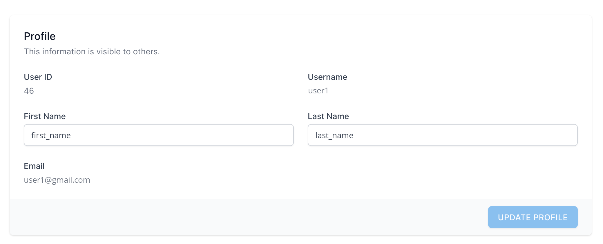
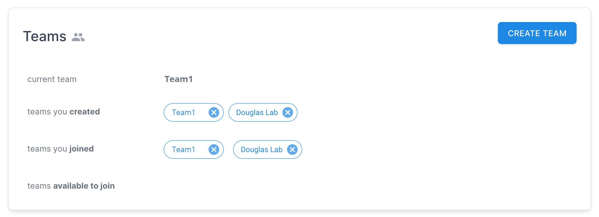
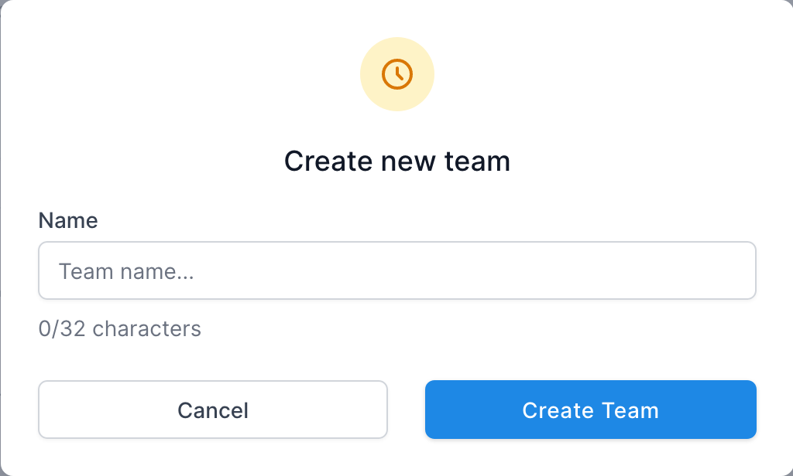
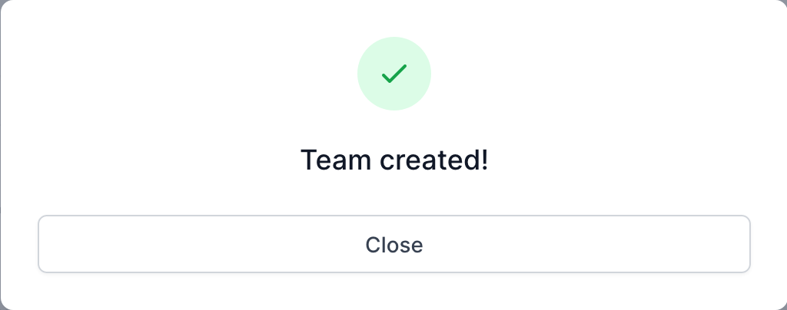
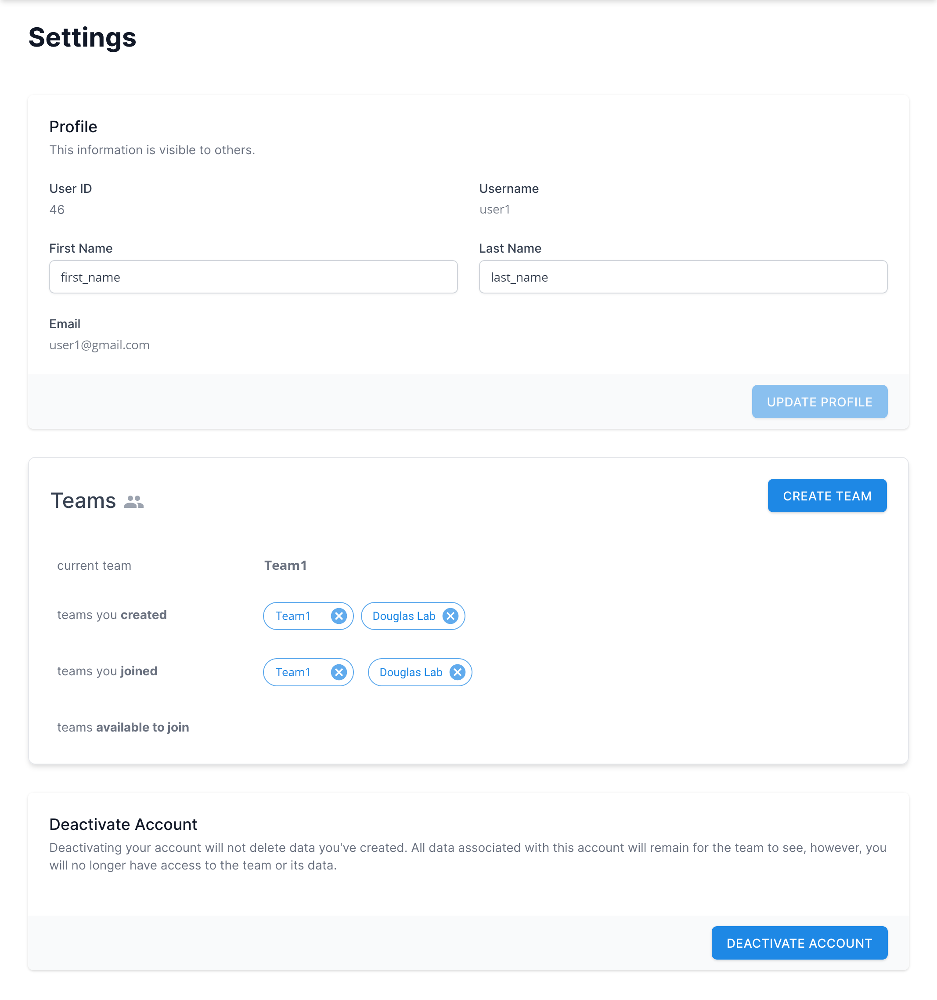
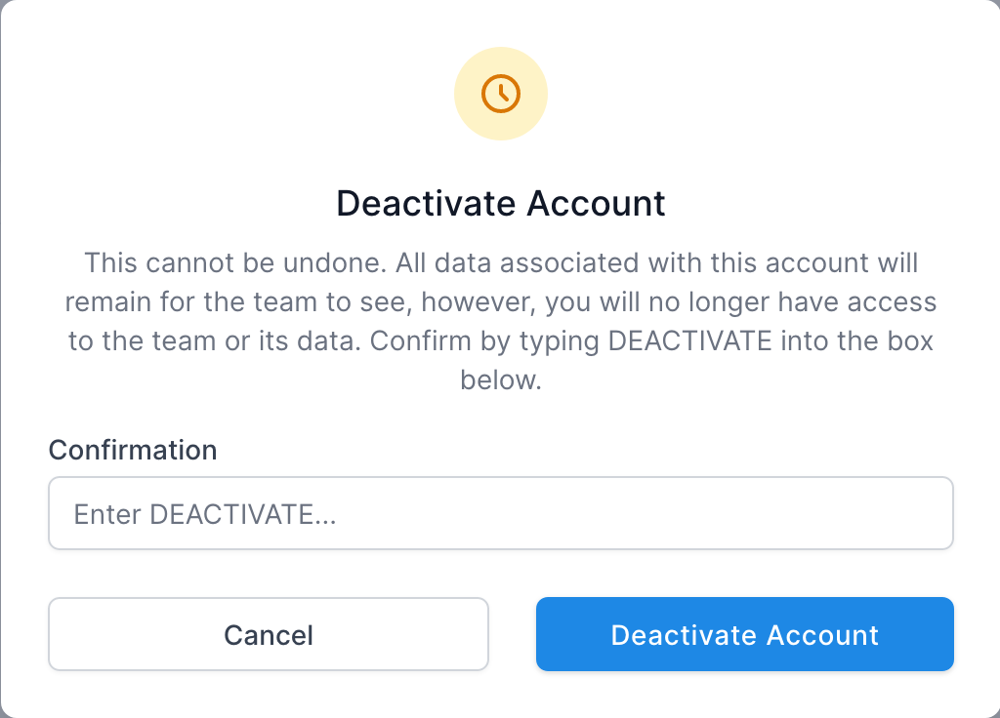

# Settings [TODO]

[Purpose](#purpose)  
[User Profile](#user-profile)   
[Teams](#teams)  
[Deactivate Account](#deactivate-account)  
[FAQ / Troubleshooting](#faq--troubleshooting)  

## Purpose
---
[TODO]

* User Profile
* Teams
* Deactivate Account

The settings are accessed by clicking the profile icon 
in the top right corner of the site.

 

## User Profile
---

The User Profile contains basic info about the user.
* **ID** - The database ID for the user
* **Username** - The username used throughout the site.
This is the name taht will show up in the owner and creator
columns of many of the nanotoolkit tables.
* **First Name**, **Last Name** - The actualy first and last name
of the user.
* **Email** - The user's email address. This is provided when the 
account is created and must be unique. It cannot be changed later.
  (TODO - Should this be something that the user can update?)

### Update Profile
The **First Name** and **Last Name** of the user can be changed by 
entering new values in the respective fields and 
clicking **Update Profile**. 

 

## Teams
---

The Teams panel identifies all team relationships associated with the user.
* **current team** - The team that is currently being used in the app.
* **teams created** (by the user) - These are teams the user has created
and is the administrator for. Clicking the '**X**' icon next to the team
name will provide a dialog to delete the team (and all associated data).
* **teams joined** - These are teams created by someone else that the user has joined. 
Clicking the '**X**' icon next to the team name will provide a dialog to 
remove the user from the team (and lose access to all associated data)
* **teams available to join** - These are team created by someone else
that have invited the user to join. Clicking the team name will make the 
user a part of that team, after which the team will show up in the 
team switcher and the user will be able to view data for that team.

### Create Team
There is also a button to create a new team. 
1. Click to open Create Team dialog.   

2. Enter a new Team Name and click **Create Team**. A confirmation dialog will 
appear if the team was created successfully.   

 

## Deactivate Account
---

At the very bottom of the Settings page is an option to deactivate
the user account. This is an action that cannot be undone. All
data associated with the account will remain for the respective
team to see, however, the user will no longer have access to any 
teams or its data. That said, the user can create a new account in the future
using a different email address.

1. Click the button to open a dialog. Type **DEACTIVATE** in the 
teact field and click the **Deactivate Account** button. 

 

## FAQ / Troubleshooting
---
 

