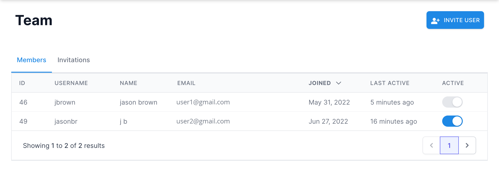
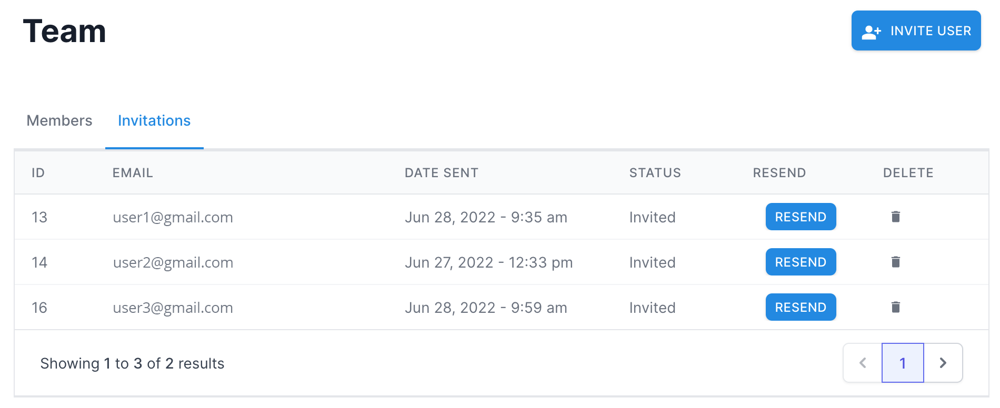

# Teams [TODO]

[Purpose](#purpose)  
[Create a Team](#create-a-team)   
[Join a Team](#join-a-team)  
[Team Members](#team-members)  
[FAQ / Troubleshooting](#faq--troubleshooting)  

## Purpose
---
[TODO]

* Create teams with controlled access for members only
* Invite new users
* Remove users as needed

 

## Create a Team
---
...

 

## Join a Team
---
...

 

## Team Members
---
...

#### Invite Users
...

#### Manage Invitations
...
 

#### Remove Someone from a Team
---
...

 

## FAQ / Troubleshooting
---
 

