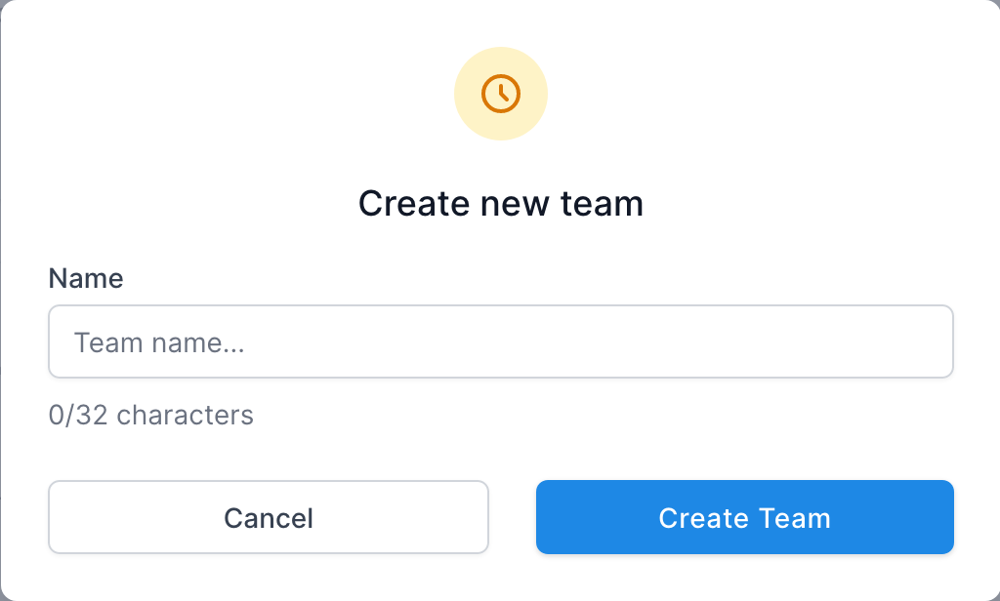
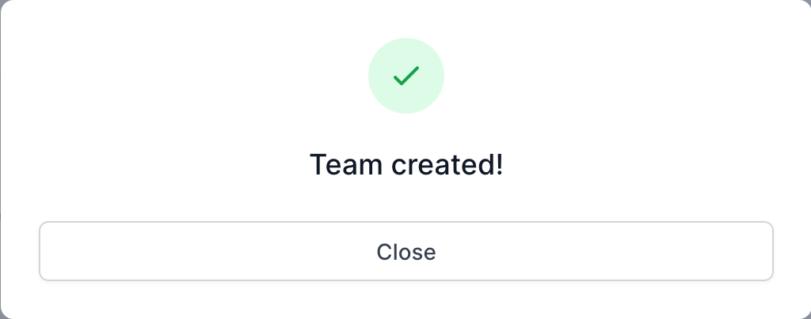

# Teams [TODO]

[Purpose](#purpose)  
[Team Members](#team-members)  
[Invitations](#invitations)  
[Create a Team](#create-a-team)   
[Join a Team](#join-a-team)  
[FAQ / Troubleshooting](#faq--troubleshooting)  

## Purpose
---
[TODO]

* Create teams with controlled access for members only
* Invite new users
* Remove users as needed

 

## Team Switching
Every time you log into Nanotoolkit, you will be given a choice to select the 
team you want to work on, otherwise known as the **Active Team**. Once selected, the app will show all data and options
for that particular team. 

It is also easy to switch to a different team while already in the app. In the top left corner of the app, in the navigation sidebar, there is a **Team Switcher**
menu. Clicking this menu will display all teams the user is a part of. Selecting another team
will reopen the app with the selected Team's data, and the user can work in that space until 
logged out or another team is selected.

## Team Members
---

The Team page displays all members for the currently active team with the following columns:

* **ID** - Member id number.
* **Username** - The username of the user.
* **Name** - The name of the user.
* **Email** - The email of the user.
* **Joined** - The date the user joined the team.
* **Last Active** - Time since the user was last active on the site.

[comment]: <> (* **Active** &#40;Team owner only&#41; - A toggle switch to set the user to Active &#40;can participate on the team&#41;)

[comment]: <> (or Inactive &#40;cannot participate on the team&#41;.)

#### Remove Someone from a Team
This feature is only available to team owners. An additional column - **Active** - will be displayed
on the Teams table for team owners. Toggling this switch will set the team member's status to either
Active (can participate on the team) or Inactive (cannot participate on the team).

 

## Invitations
---
If the user is the creator of the team, there are additional controls available.
These controls are related to inviting new users and managing member access.
* [Invite Users](#invite-users)
* [Invitations Table](#invitations-table)
* [Invitation Email](#invitation-email)

### Invite Users

The team owner will have an **Invite User** button in the top right corner of the page.

1. Click to open Invite User dialog.   
   

2. Enter email of user to invite to the team and click **Invite User**. Note, the user 
may already have a particular email they use for other teams on Nanotoolkit. It's
best to use the same email here, if known. A confirmation dialog will
appear if the team was created successfully.   
   

### Invitations Table

The team owner will have an **Invitations** tab in addition to the Members tab. Clicking this tab will 
display the Invitations table, which shows all currently open team invitations with the following columns:
* **ID** - Member id number.
* **Email** - The email of the user.
* **Date Sent** - The date and time the invitation was sent.
* **Status** - Status of the invitation (Invited, Joined)
* **Resend** - Button to resend the invitation to the user's email.
* **Delete** - Button to remove the invitation. The invited user will no longer be able to join unless invited
again.

### Invitation Email
When a user is invited to join the team, an email will be sent to the invited user's provided email address.
The email contain a link that, when clicked, will add the user to the team and grant them access. 

## Create a Team
---
Teams can be created on the [Settings](settings.md) page by clicking the profile icon in the upper
right corner of the app.

On the Settings page:
1. Click to open Create Team dialog.   
   

2. Enter a new Team Name and click **Create Team**. A confirmation dialog will
   appear if the team was created successfully.   
   

 

 

## Join a Team
---
Teams can be created on the [Settings](settings.md) page by clicking the profile icon in the upper
right corner of the app. There is also an option to join available teams, if any, when first setting up 
your account.

On the **Settings** page, **Teams** panel, there is a field called "**teams available to join**."
If there are any teams available, they will show up here. These are team created by someone else 
that have invited the user to join. Clicking the team name will make the
user a part of that team, after which the team will show up in the
team switcher and the user will be able to view data for that team.

 

## FAQ / Troubleshooting
---
 

